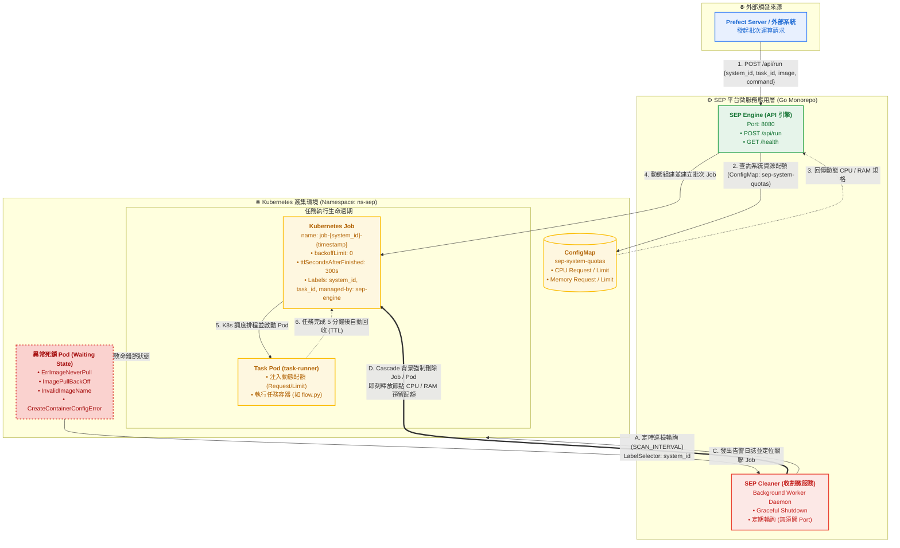

# SEP - Serverless Execution Platform (無伺服器執行平台)

**SEP (Serverless Execution Platform)** 是一個輕量、高擴展的 Kubernetes 批次任務執行平台。系統接收來自 Prefect 或外部排程系統的任務請求，動態在 K8s 叢集上建立隔離的批次 Job 執行；並內建獨立的異常死 Pod 自動收割監控微服務（Pod Cleaner），主動偵測不可逆錯誤並即刻釋放叢集 CPU 與記憶體配額。

---

## 系統架構



---

## 專案結構

```text
├── common/                        # 【跨服務共用層】兩個微服務共享的基礎建設
│   ├── config/                    # 環境變數載入與設定結構定義
│   │   └── config.go              # EngineConfig / CleanerConfig：從 .env 或系統環境變數載入設定
│   ├── kube/                      # K8s 連線管理
│   │   └── client.go              # 初始化 Kubernetes Clientset，In-Cluster 優先，本機自動 Fallback 至 ~/.kube/config
│   └── model/                     # 共用 DTO 資料模型
│       └── run.go                 # RunRequest（任務請求）/ RunResponse（回應），含欄位驗證規則
│
├── charts/                        # 【Helm 部署定義】
│   ├── Chart.yaml                 # Helm Chart 定義 (name: sep)
│   ├── values.yaml                # 基礎通用設定與配額定義
│   ├── dev/values.yaml            # Dev 開發環境設定
│   ├── stg/values.yaml            # Staging 測試環境設定
│   ├── prod/values.yaml           # Production 正式環境設定
│   └── templates/                 # K8s 渲染模板 (ConfigMap, Deployments, Service)
│       ├── configmap-quotas.yaml  # 動態配額 ConfigMap 模板
│       ├── deployment-engine.yaml # Engine API 部署模板
│       ├── deployment-cleaner.yaml# Cleaner Daemon 部署模板
│       └── service-engine.yaml    # Engine 固定入口 Service (LoadBalancer / ClusterIP)
│
├── configMap/                     # K8s 基礎設施設定 (純 YAML 模式)
│   └── system-quotas.yaml         # 各系統 CPU / Memory 配額定義（sep-system-quotas）
│
├── services/                      # 【微服務應用層】可獨立編譯運行的微服務集合
│   ├── cleaner/                   # 【微服務 2】SEP 異常 Pod 自動收割監控服務，純背景 Worker
│   │   ├── service/               # 業務邏輯層
│   │   │   └── cleaner.go         # 核心服務：定時巡檢 Pod 狀態，偵測致命錯誤並自動刪除 Job/Pod
│   │   └── main.go                # 啟動入口：初始化 Config、K8s Client，支援 Graceful Shutdown
│   │
│   └── engine/                    # 【微服務 1】SEP API 觸發引擎，對外暴露 HTTP 接口
│       ├── controller/            # HTTP Handler 層，負責解析請求與回應
│       │   ├── health.go          # GET /health：健康檢查端點
│       │   └── run.go             # POST /api/run：接收任務請求，呼叫 JobLauncher 建立 K8s Job
│       ├── router/                # Gin 路由設定，集中管理所有路由與 middleware
│       │   └── router.go          # 路由註冊：/health 與 /api/run 路由綁定
│       ├── service/               # 業務邏輯層
│       │   └── launcher.go        # 核心服務：從 ConfigMap 解析配額、組建 Job Spec、建立 Job
│       └── main.go                # 啟動入口：初始化 Config、K8s Client、JobLauncher，啟動 Gin Server
│
├── test/                          # 測試與開發工具
│   └── api.http                   # IDE HTTP Client 測試檔（GoLand / VS Code REST Client）
│
├── flow.py                        # Prefect Flow 範例，在 K8s Pod 內執行的批次任務腳本
├── go.mod                         # Go Module 宣告與依賴管理 (module: sep)
└── go.sum                         # 依賴版本鎖定檔
```

---

## 事前準備

### 必要環境
- Go 1.25+
- kubectl
- OrbStack / Docker Desktop（或其他 K8s 叢集）

### 確認 K8s 叢集連線
```bash
kubectl config current-context
# 預期輸出：orbstack (或 docker-desktop / minikube)
```

### 套用系統配額 ConfigMap
```bash
# 確保 namespace 存在
kubectl create namespace ns-sep --dry-run=client -o yaml | kubectl apply -f -
kubectl create namespace ns-sep-stg --dry-run=client -o yaml | kubectl apply -f -

# 套用配額表 (純 YAML 模式)
kubectl apply -f configMap/system-quotas.yaml

# 確認套用成功
kubectl get configmap sep-system-quotas -n ns-sep
```

### 配置 Kubernetes RBAC 權限（重要）
當 SEP Engine 部署在 K8s 叢集內部時，需要權限存取 ConfigMap 與動態建立 Job。需為對應 Namespace 的 ServiceAccount 授權：

```bash
# 選項 A：全叢集授權（推薦本機開發 / Staging 跨環境測試）
kubectl create clusterrolebinding sep-engine-stg-global-admin \
  --clusterrole=admin \
  --serviceaccount=ns-sep-stg:default

# 選項 B：單一 Namespace 隔離授權（符合最小權限規範）
kubectl create rolebinding default-admin \
  --clusterrole=admin \
  --serviceaccount=ns-sep-stg:default \
  -n ns-sep-stg
```
> **原理**：Pod 預設以 `default` ServiceAccount 運行。未授權時存取 K8s API 會引發 `403 Forbidden`。

---

## 本機啟動

### 1. 啟動 SEP API 引擎（主要服務）
```bash
go run ./services/engine
```
啟動成功後會看到：
```
[INFO] 非 In-Cluster 環境，改用 ~/.kube/config 連線（本機開發模式）
🚀 [Engine] 服務啟動於 Port: 8080
```

### 2. 啟動 SEP Pod Cleaner 異常收割監控服務（背景微服務）
```bash
go run ./services/cleaner
```
啟動成功後會看到：
```
[INFO] 正在初始化 Pod Cleaner 監控微服務...
[INFO] 非 In-Cluster 環境，改用 ~/.kube/config 連線（本機開發模式）
🚀 [Cleaner] 異常 Pod 收割微服務啟動，巡檢週期: 5s, 目標 Namespace: 'ns-sep'
```

> **注意**：Cleaner 為純背景 Worker，不需要開任何 Port，無需建立 K8s Service 或 Ingress。

---

## Kubernetes 叢集部署（Helm 模式）

專案內建一鍵部署腳本 `deploy.sh`，整合了 ConfigMap 同步、Helm 渲染部署與 Deployment 優雅重啟：

### 1. 執行部署
```bash
# 基本部署：同步 .env 至 ConfigMap 並執行 Helm upgrade/install
./deploy.sh stg

# 完整部署：包含本地 Docker Image 重新打包 (改動 Go 程式碼時使用)
./deploy.sh stg --build
```

### 2. 服務發現與固定入口（Service 架構）
為了解決 Pod 重啟 / 滾動更新時動態 IP 變動的問題，架構在 Engine 前方配置了 Kubernetes Service（`sep-engine-svc`，類型預設為 `LoadBalancer`）：

```text
[外部呼叫端 / Prefect] 
       │
       ▼ (固定門牌 IP / 網域名稱)
[Kubernetes Service: sep-engine-svc]
       │
       ├─► 負載均衡分流至 Engine Pod 1
       └─► 負載均衡分流至 Engine Pod 2
```

**連線與測試管道：**
- **OrbStack 外部 IP 直連**：`kubectl get svc -n ns-sep-stg` 取得 `EXTERNAL-IP`（如 `http://192.168.139.2:8080`）。
- **K8s 叢集內部 CoreDNS**：內部微服務可直接存取 `http://sep-engine-svc:8080` 或完整 FQDN `http://sep-engine-svc.ns-sep-stg.svc.cluster.local:8080`。
- **本地域名模擬 (/etc/hosts)**：
  ```bash
  echo "192.168.139.2  sep.local" | sudo tee -a /etc/hosts
  curl http://sep.local:8080/health
  ```
- **本機 Port-Forward 穩定連線**：
  ```bash
  kubectl port-forward -n ns-sep-stg svc/sep-engine-svc 8080:8080
  curl http://localhost:8080/health
  ```

---

## API 規格

### 1. 健康檢查
```bash
curl http://localhost:8080/health
```

### 2. 建立任務 Job
```bash
curl -s -X POST http://localhost:8080/api/run \
  -H "Content-Type: application/json" \
  -d '{
    "system_id": "crawler",
    "task_id": "flow-run-abc123",
    "namespace": "ns-sep",
    "image": "python:3.11-alpine",
    "command": ["python", "flow.py"]
  }'
```

**Request 欄位說明**

| 欄位 | 型別 | 必填 | 說明 |
|------|------|------|------|
| `system_id` | string | ✅ | 系統識別碼，需在 ConfigMap 中有對應配額（max 40 字元） |
| `task_id` | string | ✅ | 任務唯一識別碼，如 Prefect flow_run_id（max 63 字元） |
| `namespace` | string | — | 目標 Namespace（若未填則預設為 `ns-sep`） |
| `image` | string | ✅ | 要執行的容器 image |
| `command` | array | — | 覆蓋容器預設指令（如 `["python", "flow.py"]`，未填則使用 Dockerfile 預設 CMD） |

**Response 範例**
```json
{
  "status": "ok",
  "message": "已成功接收 TaskID:flow-run-abc123",
  "job_name": "job-crawler-1787493682127"
}
```

---

## 系統配額管理

配額設定在 `configMap/system-quotas.yaml`（或 Helm `values.yaml`），每個系統需定義 4 個 key：

```yaml
# 格式：<system_id>.<resource>
crawler.cpu_request: "250m"
crawler.memory_request: "512Mi"
crawler.cpu_limit: "500m"
crawler.memory_limit: "1Gi"
```

目前支援的系統：`crawler` / `reporting` / `analytics`。新增系統時在 yaml 加入對應配額後重新套用即可。

---

## 常用維運指令

### 1. 服務與網路診斷（Service & Pod IP）
```bash
# 查詢 Pod 運行節點與內部 IP（-o wide）
kubectl get pods -n ns-sep-stg -o wide

# 查詢 Service 門牌與分配之 LoadBalancer External-IP
kubectl get svc -n ns-sep-stg

# 【實用】利用標籤一次打包查詢 Engine 家族所有元件 (Pod, Svc, Deployment, ReplicaSet, ConfigMap)
kubectl get all,cm -n ns-sep-stg -l app=sep-engine

# 驗證 K8s 內部 CoreDNS 解析與 Service 轉發（啟動臨時容器測試）
kubectl run test-dns --rm -it --image=curlimages/curl --restart=Never -n ns-sep-stg \
  -- curl -s http://sep-engine-svc:8080/health
```

### 2. 任務 Job 與 Pod 生命週期查詢
```bash
# 查看 SEP 配額 ConfigMap
kubectl get configmap sep-system-quotas -n ns-sep-stg

# 查看目前由 SEP Engine 建立的 Job 與 Pod（以 system_id 標籤篩選）
kubectl get jobs -n ns-sep-stg -l system_id
kubectl get pods -n ns-sep-stg -l system_id

# 將 system_id / task_id 展開為獨立欄位顯示（一目瞭然）
kubectl get pods -n ns-sep-stg -L system_id,task_id

# 針對特定系統或任務查詢
kubectl get pods -n ns-sep-stg -l system_id=crawler
kubectl get pods -n ns-sep-stg -l task_id=flow-run-test-001

# 一鍵清除所有 Engine 管理的 Job（Cleaner 通常會自動處理，手動清除時使用）
kubectl delete jobs -n ns-sep-stg -l system_id

# 查看 Pod 詳細資訊與即時 Log
kubectl describe pod <pod-name> -n ns-sep-stg
kubectl logs -f <pod-name> -n ns-sep-stg
```

### 3. RBAC 權限維護
```bash
# 賦予 default 帳號跨 Namespace 最高管理權限（開發模式通用）
kubectl create clusterrolebinding sep-engine-stg-global-admin \
  --clusterrole=admin \
  --serviceaccount=ns-sep-stg:default

# 查詢當前 RoleBinding 狀態
kubectl get rolebinding,clusterrolebinding | grep sep-engine
```

---

## 環境變數

### Engine（`services/engine/.env` 或根目錄 `.env`）
 
| 變數 | 說明 | 預設 |
|------|------|------|
| `NAMESPACE` | 管理配額 ConfigMap 與 Job 所在的 Namespace | `ns-sep` |
| `PORT` | 服務監聽 Port | `8080` |
| `IMAGE_PULL_POLICY` | Image 拉取策略（`Always` / `IfNotPresent` / `Never`） | `Never` |
| `SYSTEM_QUOTAS_CONFIGMAP` | 配額 ConfigMap 名稱 | `sep-system-quotas` |
| `GIN_MODE` | Gin 模式（`debug` / `release`） | `debug` |
 
### Cleaner（`services/cleaner/.env`）

| 變數 | 說明 | 預設 |
|------|------|------|
| `TARGET_NAMESPACE` | 監控目標 Namespace（空字串代表跨全叢集監控） | `ns-sep` |
| `SCAN_INTERVAL` | 異常 Pod 巡檢週期，需帶單位（如 `5s`、`30s`、`1m`） | `5s` |

---

## 來源系統接入規範（Source System Integration Spec）

> 本章節定義所有接入 SEP 的來源系統（如爬蟲、報表、分析等）在 CI/CD 流程與 Image 管理上必須遵守的設計規範。
> SEP Engine 完全信任來源端傳入的 `image` 欄位，因此**版本安全閘門的責任在來源端**，而非 SEP。

---

### 核心設計原則

```
SEP 的職責：接受請求、查配額、建 Job            ← 不變
來源端的職責：決定「此刻該跑哪個版本的 Image」   ← 由來源端自己管理
```

兩者職責分離，SEP 無需理解任何來源系統的 CI/CD 時程邏輯。

---

### 一、Image Tag 命名規範

#### ❌ 禁止使用 Mutable Tag

| 禁止 | 原因 |
|------|------|
| `:latest` | CI 推新 image 後立刻生效，觸發 race condition |
| `:main`、`:master`、`:dev` | 與分支綁定，同樣是 mutable，每次 push 都會覆蓋 |

#### ✅ 必須使用 Immutable Tag

推薦格式（由最佳到可接受）：

| 格式 | 範例 | 說明 |
|------|------|------|
| Git Commit SHA（推薦） | `myapp:git-a3f1c2d` | 最具可追溯性，能直接定位原始碼版本 |
| SHA + 日期時間 | `myapp:git-a3f1c2d-20260919-1045` | 兼顧可讀性與可追溯性，本專案推薦格式 |
| Semantic Version | `myapp:v1.2.3` | 適合有正式版號管理的系統 |
| Image Digest | `myapp@sha256:abc123...` | 最嚴格的 immutable，推薦 Production 使用 |

**CI Pipeline 範例（GitHub Actions）：**
```yaml
# .github/workflows/ci.yml
- name: Build & Push Image
  env:
    GIT_SHA: ${{ github.sha }}
    BUILD_TIME: ${{ steps.date.outputs.date }}   # 格式：YYYYMMDD-HHmm
  run: |
    IMAGE_TAG="git-${GIT_SHA::7}-${BUILD_TIME}"
    docker build -t myapp:${IMAGE_TAG} .
    docker push myapp:${IMAGE_TAG}
    echo "IMAGE_TAG=${IMAGE_TAG}" >> $GITHUB_OUTPUT  # 傳給後續步驟
```

---

### 二、來源端 ConfigMap 設計（版本閘門）

來源系統需在自己的 Namespace 維護一個 ConfigMap，作為「**當前已上線（CD 完成）的 Image Tag**」的唯一來源。

#### ConfigMap 結構範例

```yaml
# source-system/k8s/app-config.yaml
apiVersion: v1
kind: ConfigMap
metadata:
  name: crawler-app-config        # 各系統自行命名，與 SEP 無關
  namespace: ns-crawler           # 來源系統自己的 Namespace
data:
  # SEP 接入版本閘門
  current_image: "myapp:git-a3f1c2d-20260919-1045"   # CD 完成後才更新此欄位

  # 可依需求加入其他設定（與 SEP 無關）
  env: "production"
  log_level: "info"
```

> **重要**：`current_image` 只在 **CD 完成後**才更新。CI 階段嚴禁修改此欄位。

---

### 三、CI / CD 各階段責任分工

```
┌─────────────────────────────────────────────────────────────────────┐
│                    來源系統 CI 階段（只做建置）                        │
│                                                                     │
│  1. 編譯 / 測試 / 掃描                                               │
│  2. docker build → push myapp:git-a3f1c2d-20260919-1045            │
│  3. ✅ 結束。ConfigMap 不動，Prefect 排程繼續跑舊版                    │
└─────────────────────────────────────────────────────────────────────┘
              ↓ （人工審核 / 自動 Gate 通過後才觸發）
┌─────────────────────────────────────────────────────────────────────┐
│                    來源系統 CD 階段（部署上線）                        │
│                                                                     │
│  1. 執行 DB Migration、環境設定變更等前置作業                          │
│  2. kubectl patch configmap crawler-app-config \                    │
│       --patch '{"data":{"current_image":"myapp:git-a3f1c2d-..."}}'  │
│  3. ✅ 結束。下一次 Prefect 觸發就會用新版 Image                       │
└─────────────────────────────────────────────────────────────────────┘
              ↓
┌─────────────────────────────────────────────────────────────────────┐
│               來源系統 排程觸發（Prefect / Cron 等）                  │
│                                                                     │
│  1. 從 ConfigMap 讀取 current_image                                  │
│  2. POST /api/run {                                                  │
│       "system_id": "crawler",                                       │
│       "task_id":   "flow-run-abc123",                               │
│       "image":     "myapp:git-a3f1c2d-20260919-1045",  ← 從 CM 讀   │
│       "command":   ["python", "flow.py"]                            │
│     }                                                               │
│  3. SEP Engine 建立 Job，跑的永遠是 CD 已驗證上線的版本               │
└─────────────────────────────────────────────────────────────────────┘
```

**Race Condition 防護時序：**

| 時間點 | 事件 | ConfigMap `current_image` | Job 跑的版本 |
|--------|------|--------------------------|-------------|
| T1 | CI 推 `git-new-xxx` | `git-old-aaa`（未動） | `git-old-aaa` ✅ |
| T2 | Prefect 觸發排程 | `git-old-aaa` | `git-old-aaa` ✅（不受影響）|
| T3 | CD 完成，更新 CM | `git-new-xxx` | — |
| T4 | 下次 Prefect 觸發 | `git-new-xxx` | `git-new-xxx` ✅ |

CI 今天做、明天才 CD？沒問題，ConfigMap 不依時程，隨時 CD 都安全。

---

### 四、Prefect Flow 讀取 ConfigMap 範例

```python
# flow.py（Prefect 觸發端）
from prefect import flow
from kubernetes import client, config

def get_current_image(namespace: str, cm_name: str, key: str = "current_image") -> str:
    """從來源系統自己的 ConfigMap 取得當前已上線的 Image Tag"""
    config.load_incluster_config()   # K8s 叢集內部使用 in-cluster config
    v1 = client.CoreV1Api()
    cm = v1.read_namespaced_config_map(name=cm_name, namespace=namespace)
    return cm.data[key]

@flow
def trigger_sep_job():
    image = get_current_image("ns-crawler", "crawler-app-config")
    # image = "myapp:git-a3f1c2d-20260919-1045"（CD 完成後的版本）

    response = requests.post("http://sep-engine-svc.ns-sep.svc.cluster.local:8080/api/run", json={
        "system_id": "crawler",
        "task_id":   prefect.runtime.flow_run.id,
        "image":     image,   # ← 永遠從 ConfigMap 讀，而非寫死
        "command":   ["python", "flow.py"]
    })
```

---

### 五、設計驗證：是否符合正規 K8s / Helm / CI/CD 規範？

#### ✅ 符合的業界標準

| 規範 | 你的設計 | 業界標準依據 |
|------|---------|------------|
| **Immutable Image Tag** | Git SHA + 日期時間 | Google Cloud、AWS ECR、Docker 官方最佳實踐均建議禁用 `:latest` |
| **CI / CD 職責分離** | CI 只 Build，CD 才改版本閘門 | GitOps（Argo CD / Flux）的核心原則：Build 與 Deploy 分離 |
| **ConfigMap 作為版本閘門** | `current_image` 由 CD 更新 | 等同 GitOps 中「Git 是唯一事實來源」的概念，差異在於用 ConfigMap 取代 Git repo，適合動態 Job 系統 |
| **排程讀 ConfigMap 決定版本** | Prefect 每次觸發前讀 CM | 符合「Runtime 配置與程式碼分離」的 12-Factor App 原則（Factor III: Config） |
| **SEP 不介入版本邏輯** | SEP 只接受 image 並建 Job | 符合單一職責原則（SRP），SEP 是基礎設施層，不應耦合業務版本邏輯 |

#### ⚠️ 與純 GitOps 的差異（非缺點，是刻意取捨）

純 GitOps（如 Argo CD）的做法是：CD 更新 Git repo 中的 `values.yaml` image tag → Argo CD 偵測到 Git 變更 → 自動 sync 部署。

你的做法改用 **ConfigMap 作為版本狀態儲存**，主要原因是：

- SEP 建立的是**動態 Job**，不是固定 Deployment
- Job 的 image 由呼叫端即時傳入，不存在「一個固定部署版本」的概念
- 來源系統可能有多個版本同時跑（不同 task_id），Deployment 模型不適用

**結論：你的設計對 Dynamic Job 場景是正確且務實的做法。** 業界類似案例包括 Argo Workflows、Prefect Agent 等動態任務平台，均採用呼叫端決定 image 的模式，搭配 CI/CD 管控 image tag 的變更時機。

---

### 六、快速驗證 Checklist（新系統接入時使用）

```bash
# ✅ 1. 確認 image tag 非 mutable
echo $IMAGE_TAG | grep -E "^.+:(git-[a-f0-9]|v[0-9]+\.[0-9]+|sha256)" || echo "❌ Tag 格式不符規範"

# ✅ 2. 確認來源系統 ConfigMap 存在
kubectl get configmap <your-app-config> -n <your-namespace>

# ✅ 3. 確認 SEP system_id 已在配額表註冊
kubectl get configmap sep-system-quotas -n ns-sep-stg -o jsonpath='{.data}'

# ✅ 4. 試打 /api/run 確認 Job 正常建立
curl -s -X POST http://sep-engine-svc:8080/api/run \
  -H "Content-Type: application/json" \
  -d "{\"system_id\":\"<your-system-id>\",\"task_id\":\"test-001\",\"image\":\"$IMAGE_TAG\",\"command\":[\"echo\",\"hello\"]}"
```
