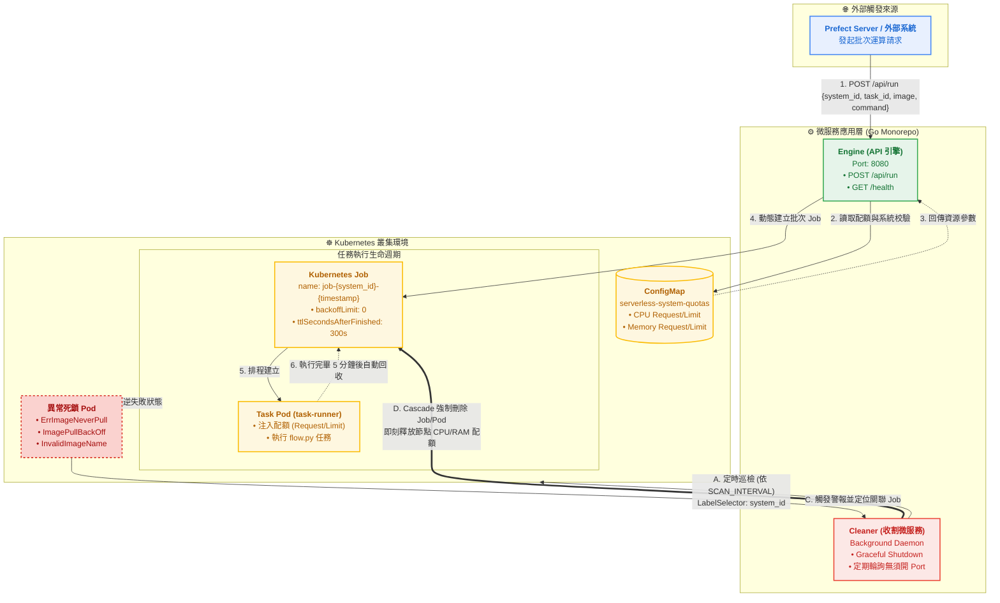

# Kubernetes Serverless Engine

一個輕量、高擴展的 Kubernetes Serverless 執行引擎，接收來自 Prefect 的任務請求，動態在 K8s 叢集上建立 Job 執行；並附帶獨立的死 Pod 自動收割監控微服務，確保叢集資源不被異常 Pod 卡死。

---

## 系統架構



---

## 專案結構

```text
├── services/                      # 【微服務應用層】可獨立編譯運行的微服務集合
│   ├── engine/                    # 【微服務 1】Serverless API 觸發引擎，對外暴露 HTTP 接口
│   │   ├── main.go                # 啟動入口：初始化 Config、K8s Client、JobLauncher，啟動 Gin Server (Port 8080)
│   │   ├── controller/            # HTTP Handler 層，負責解析請求與回應
│   │   │   ├── health.go          # GET /health：健康檢查端點
│   │   │   └── run.go             # POST /api/run：接收任務請求，呼叫 JobLauncher 建立 K8s Job
│   │   ├── router/                # Gin 路由設定，集中管理所有路由與 middleware
│   │   │   └── router.go          # 路由註冊：/health 與 /api/run 路由綁定
│   │   └── service/               # 業務邏輯層
│   │       └── launcher.go        # 核心服務：從 ConfigMap 解析配額、組建 Job Spec、呼叫 K8s API 建立 Job
│   │
│   └── cleaner/                   # 【微服務 2】異常 Pod 自動收割監控服務，純背景 Worker
│       ├── main.go                # 啟動入口：初始化 Config、K8s Client，啟動 CleanerService 並支援 Graceful Shutdown
│       └── service/               # 業務邏輯層
│           └── cleaner.go         # 核心服務：定時巡檢 Pod 狀態，偵測致命錯誤（ErrImageNeverPull 等）並自動刪除 Job/Pod
│
├── common/                        # 【跨服務共用層】兩個微服務共享的基礎建設
│   ├── config/                    # 環境變數載入與設定結構定義
│   │   └── config.go              # EngineConfig / CleanerConfig：從 .env 或系統環境變數載入設定
│   ├── kube/                      # K8s 連線管理
│   │   └── client.go              # 初始化 Kubernetes Clientset，In-Cluster 優先，本機自動 Fallback 至 ~/.kube/config
│   └── model/                     # 共用 DTO 資料模型
│       └── run.go                 # RunRequest（任務請求）/ RunResponse（回應），含欄位驗證規則
│
├── configMap/                     # K8s 基礎設施設定
│   └── system-quotas.yaml         # 各系統 CPU / Memory 配額定義（crawler / reporting / analytics）
│
├── test/                          # 測試與開發工具
│   └── api.http                   # IDE HTTP Client 測試檔（GoLand / VS Code REST Client）
│
├── flow.py                        # Prefect Flow 範例，在 K8s Pod 內執行的批次任務腳本
├── go.mod                         # Go Module 宣告與依賴管理（根目錄統一管理兩個微服務）
└── go.sum                         # 依賴版本鎖定檔
```

---

## 事前準備

### 必要環境
- Go 1.21+
- kubectl
- OrbStack（或其他 K8s 叢集）

### 確認 K8s 叢集連線
```bash
kubectl config current-context
# 預期輸出：orbstack
```

### 套用系統配額 ConfigMap
```bash
kubectl apply -f configMap/system-quotas.yaml

# 確認套用成功
kubectl get configmap serverless-system-quotas
```

---

## 本機啟動

### 1. 啟動 Serverless API 引擎（主要服務）
```bash
go run ./services/engine
```
啟動成功後會看到：
```
[INFO] 非 In-Cluster 環境，改用 ~/.kube/config 連線（本機開發模式）
[Engine] 服務啟動於 Port: 8080
```

### 2. 啟動 Pod Cleaner 異常收割監控服務（背景微服務）
```bash
go run ./services/cleaner
```
啟動成功後會看到：
```
[INFO] 正在初始化 Pod Cleaner 監控微服務...
[INFO] 非 In-Cluster 環境，改用 ~/.kube/config 連線（本機開發模式）
🚀 [Cleaner] 異常 Pod 收割微服務啟動，巡檢週期: 30s, 目標 Namespace: '' (空字串代表全叢集)
```

> **注意**：Cleaner 為純背景 Worker，不需要開任何 Port，無需建立 K8s Service 或 Ingress。

---

## API 規格

### 1. 健康檢查
```bash
curl http://localhost:8080/health
```

### 2. 建立任務 Job
```bash
curl -s -X POST http://localhost:8080/api/run \
  -H "Content-Type: application/json" \
  -d '{
    "system_id": "crawler",
    "task_id": "flow-run-abc123",
    "namespace": "default",
    "image": "python:3.11-alpine",
    "command": ["python", "flow.py"]
  }'
```

**Request 欄位說明**

| 欄位 | 型別 | 必填 | 說明 |
|------|------|------|------|
| `system_id` | string | ✅ | 系統識別碼，需在 ConfigMap 中有對應配額（max 40 字元） |
| `task_id` | string | ✅ | 任務唯一識別碼，如 Prefect flow_run_id（max 63 字元） |
| `namespace` | string | — | 目標 Namespace（若未填則預設為 `default`） |
| `image` | string | ✅ | 要執行的容器 image |
| `command` | array | — | 覆蓋容器預設指令（如 `["python", "flow.py"]`，未填則使用 Dockerfile 預設 CMD） |

**Response 範例**
```json
{
  "status": "ok",
  "message": "已成功接收 TaskID:flow-run-abc123",
  "job_name": "job-crawler-1787493682127"
}
```

---

## 系統配額管理

配額設定在 `configMap/system-quotas.yaml`，每個系統需定義 4 個 key：

```yaml
# 格式：<system_id>.<resource>
crawler.cpu_request: "250m"
crawler.memory_request: "512Mi"
crawler.cpu_limit: "500m"
crawler.memory_limit: "1Gi"
```

目前支援的系統：`crawler` / `reporting` / `analytics`。新增系統時在 yaml 加入對應配額後重新 `kubectl apply` 即可。

---

## 常用維運指令

```bash
# 查看所有 ConfigMap
kubectl get configmap

# 查看目前由 Serverless Engine 建立的 Job 與 Pod（以 system_id 標籤篩選）
kubectl get jobs -l system_id
kubectl get pods -l system_id

# 將 system_id / task_id 展開為獨立欄位顯示（一目瞭然）
kubectl get pods -L system_id,task_id

# 針對特定系統或任務查詢
kubectl get pods -l system_id=crawler
kubectl get pods -l task_id=flow-run-abc123

# 一鍵清除所有 Engine 管理的 Job（Cleaner 通常會自動處理，手動清除時使用）
kubectl delete jobs -l system_id

# 查看 Pod 詳細資訊與 Log
kubectl describe pod <pod-name>
kubectl logs <pod-name>
```

---

## 環境變數
 
### Engine（`services/engine/.env` 或根目錄 `.env`）
 
| 變數 | 說明 | 預設 |
|------|------|------|
| `NAMESPACE` | 管理配額 ConfigMap 所在的 Namespace | `default` |
| `PORT` | 服務監聽 Port | `8080` |
| `IMAGE_PULL_POLICY` | Image 拉取策略（`Always` / `IfNotPresent` / `Never`） | `Never` |
| `SYSTEM_QUOTAS_CONFIGMAP` | 配額 ConfigMap 名稱 | `serverless-system-quotas` |
| `GIN_MODE` | Gin 模式（`debug` / `release`） | `debug` |
 
### Cleaner（`services/cleaner/.env`）

| 變數 | 說明 | 預設 |
|------|------|------|
| `TARGET_NAMESPACE` | 監控目標 Namespace，空字串代表跨全叢集監控 | `""` (全叢集) |
| `SCAN_INTERVAL` | 異常 Pod 巡檢週期，需帶單位（如 `30s`、`1m`、`500ms`） | `5s` |
